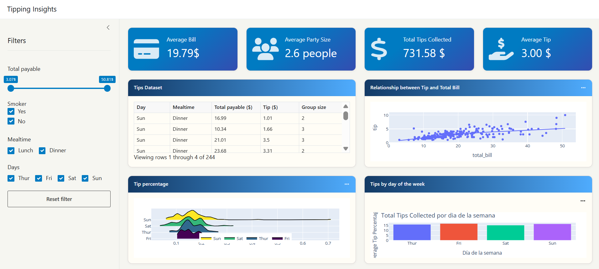

# 📊 TipInsights: Dashboard Interactivo para el Análisis de Propinas 


## 🚀 Descripción

TipInsights es una aplicación web interactiva desarrollada con Shiny para Python, diseñada para analizar patrones de propinas en restaurantes y bares a partir de datos reales. Su objetivo es facilitar la toma de decisiones basada en datos mediante visualizaciones dinámicas, métricas clave y controles intuitivos, sin necesidad de conocimientos previos en desarrollo web.

La app permite explorar la relación entre variables como el importe de la factura, el día de la semana o la hora del servicio, y el comportamiento de las propinas. A través de una interfaz interactiva y reactiva, ofrece una experiencia accesible tanto para usuarios técnicos como no técnicos.

Este proyecto demuestra cómo construir una aplicación web de análisis de datos completamente funcional utilizando únicamente Python, sin requerir HTML, CSS ni JavaScript tradicionales.



## 🔍 Características principales

- **Filtros interactivos** que permiten segmentar los datos por rango de factura y momento del servicio
- **Panel de métricas clave** que muestra estadísticas actualizadas dinámicamente
- **Visualización de correlación** entre importe de factura y propina con líneas de tendencia
- **Gráficos de densidad** para visualizar la distribución de porcentajes de propina según diferentes categorías
- **Tabla de datos completa** con todos los registros filtrados
- **Interfaz adaptable** diseñada para una experiencia óptima en diferentes dispositivos
- **Diseño intuitivo** con estética moderna y profesional

## 💻 Tecnologías utilizadas

- **Shiny para Python**: Framework para crear aplicaciones web interactivas
- **Pandas**: Manipulación y análisis de datos
- **Plotly**: Gráficos interactivos de alta calidad
- **Programación reactiva**: Actualización automática de visualizaciones en respuesta a entradas del usuario
- **CSS personalizado**: Estilización para mejorar la experiencia del usuario

## 🛠️ Habilidades demostradas

- **Análisis exploratorio de datos**: Examinar y visualizar patrones en datos reales
- **Desarrollo de aplicaciones web**: Creación de interfaces interactivas sin HTML/JavaScript
- **Programación reactiva**: Implementación de actualizaciones automáticas basadas en eventos
- **Visualización de datos**: Diseño de gráficos efectivos para comunicar insights
- **Manipulación de datos**: Filtrado, agregación y transformación de datos
- **UI/UX**: Diseño de interfaces intuitivas centradas en el usuario

## 📚 Estructura del proyecto

```
dashboard-tips/
├── app.py            # Aplicación principal con lógica de UI y servidor
├── shared.py         # Módulo para cargar datos
├── styles.css        # Estilos personalizados
├── _template.json    # Metadatos de la aplicación
├── requirements.txt  # Dependencias del proyecto
└── tips.csv          # Conjunto de datos de propinas
```

## 🚀 Cómo ejecutar el proyecto

1. Clona este repositorio
2. Instala las dependencias:
   ```bash
   pip install -r requirements.txt
   ```
3. Ejecuta la aplicación:
   ```bash
   shiny run app.py
   ```
4. Abre la URL mostrada en la terminal

## 📋 Aprendizajes y desafíos

Durante el desarrollo de este proyecto:

- Implementé un sistema de filtrado reactivo que actualiza todas las visualizaciones en tiempo real
- Diseñé visualizaciones complementarias que revelan diferentes aspectos de los mismos datos
- Optimicé la experiencia del usuario mediante controles intuitivos y feedback visual
- Ajusté el diseño visual con CSS para lograr una interfaz clara y estética
- Integré múltiples bibliotecas de Python para crear una solución cohesiva
- Aprendí a estructurar una aplicación Shiny para mantener el código organizado y mantenible

## ✨ Posibles mejoras futuras

- Opción para cargar datasets propios

## 🔗 Recursos y referencias

- [Documentación de Shiny para Python](https://shiny.posit.co/py/)
- [Documentación de Plotly](https://plotly.com/python/)

## 📞 Contacto

Mercedes de las Nieves Navarro García 

[E-mail] merchenng@gmail.com | [LinkedIn](https://www.linkedin.com/in/tu-perfil/) | [GitHub](https://github.com/mer-labnotes) 

---

*Este proyecto fue desarrollado como parte del curso Anális de Datos Avanzado con Python en Feval.*


